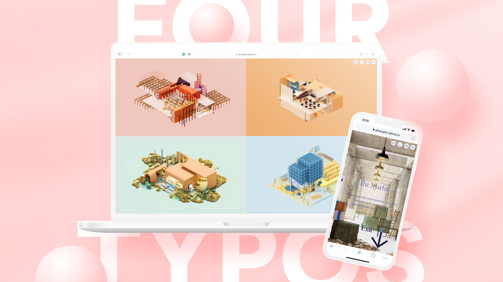
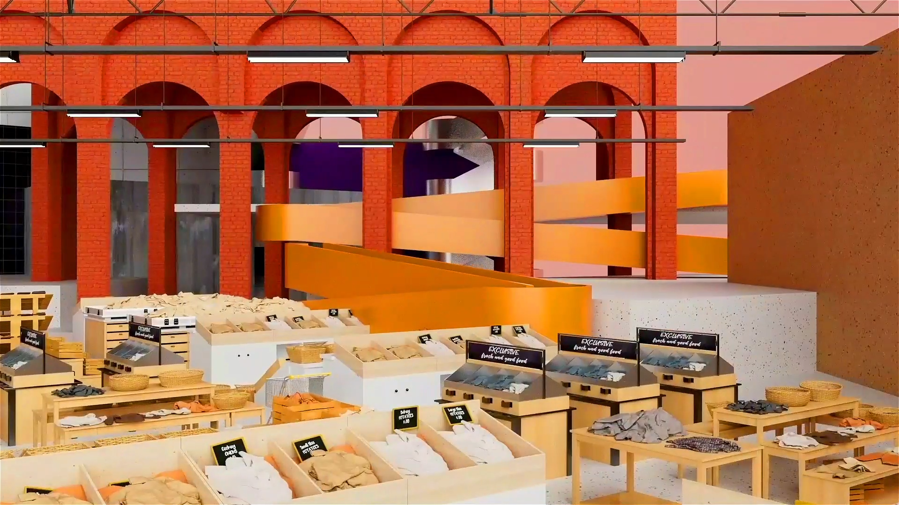
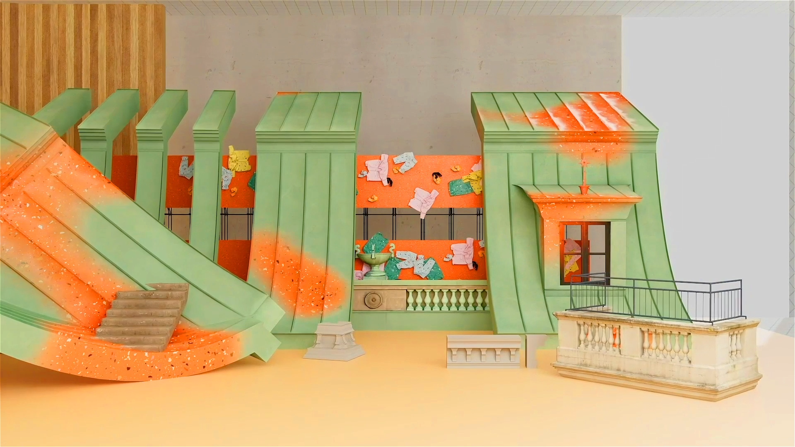
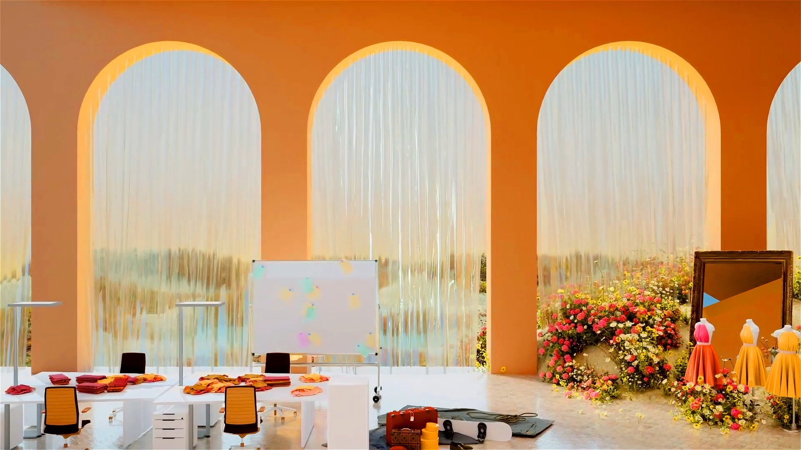
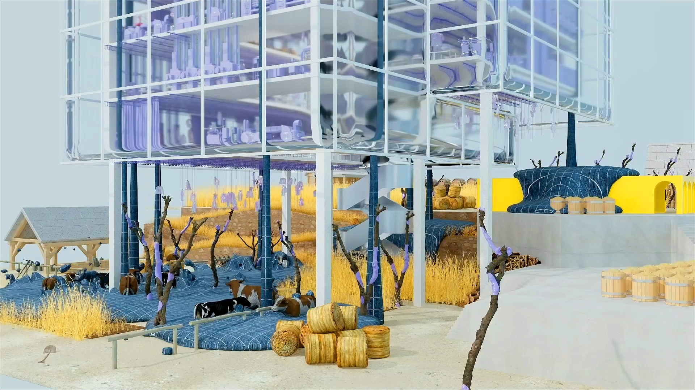

# Four Typologies in Immersive Web3 Architecture Experience

**Recognitions:**
- [2024 AVA Digital Awards in UX Creativity Platinum Winner](https://enter.amcpros.com/ava/entry/four-typologies/) by Association of Marketing and Communication Professionals
- [2024 AVA Digital Awards in Video Creativity Platinum Winner](https://enter.amcpros.com/ava/entry/four-typologies-2/) by Association of Marketing and Communication Professionals
- 2024 Interactive Competition Finalist by Communication Arts
- [2023 UX Design Awards Nominated](https://ux-design-awards.com/winners/2024-1-four-typologies) by International Design Center Berlin
- [2023 International Design Awards in Website Design Silver Winner](https://www.idesignawards.com/winners/zoom.php?eid=9-49348-23) by International Design Awards
- [2023 International Design Awards in Web Application Design Gold Winner](https://www.idesignawards.com/winners/zoom.php?eid=9-49348-23) by International Design Awards
- [2023 International Design Awards in Multimedia Animation Bronze Winner](https://www.idesignawards.com/winners/zoom.php?eid=9-49348-23) by International Design Awards
- [2023 The Motion Awards Winner in Motion Design](https://motionawards.com/four-typologies/) by Motionographer
- [2023 London Design Awards in UX Experimental / Innovative Gold Winner](https://thelondondesignawards.com/winner-info.php?id=1574) by London Design Awards
- [2023 London Design Awards in UX Art Gold Winner](https://thelondondesignawards.com/winner-info.php?id=1575) by London Design Awards
- [2023 London Design Awards in UX Best Visual Design - Aesthetic Gold Winner](https://thelondondesignawards.com/winner-info.php?id=1573) by London Design Awards
- [2023 GOOD DESIGN® Award Winner](https://www.good-designawards.com/award-details.html?award=54570) by The Chicago Athenaeum
- [2023 ASUS ProArtist Awards Animation Top 30](https://www.asus.com/campaign/ASUS-ProArtist-Awards-2023/us/winner.php) by ASUSTeK Computer Inc.
- [2023 Honorable Mention](https://www.awwwards.com/sites/four-typologies) by Awwwards
- [2023 Digital Design Awards Winner](https://gdusa.com/2023-digital-design-awards-winner?rns=0|36327131) by Graphic Design USA
  

This web project results from the exploration of the overlapping fields of architecture design, digital media practice, user experience design, and immersive web experience. It allows audiences to discover design features interactively and responsively within a website presentation format for desktop, tablet, and mobile devices. Users can navigate in the virtual environment regarding both macro and micro observation levels. It suggests the possible format of future NFT architectural products following the Web 3.0 and Metaverse tides.
  

**Quick Link:**
- [Four Typologies Website Portal](https://qihangfan.github.io)
- [Four Typologies Web App Trailer Video](https://vimeo.com/836404904)
- [The Source Animation](https://vimeo.com/836363861)
  

  

 
Contemporary fashion houses introduce a small upcycling handicraft workflow, but their factory typology is insufficient to support the nonlinear designers' activities. The media design aims to express the new Garden Factory Typologies that evoke humanity and resist conventional industrial mechanization trends. They represent emerging fashion houses that produce small batches of upcycled collections from the micro to the macro scale. And the decentralized factory typology miniatures blended with local environments - the market, the city, the nature, and the farm - are reinvented.
   

# Production
Multiple skills are involved in the entire production process.
  - 3D software for architecture and digital media production, including Rhino, Cinema 4D, and Redshift.
  - Adobe Suite for the media post-production
  - Figma for the responsive web and user experience design
  - Webstorm for the front-end development
  - Visual Studio Code to achieve the local hosting for the mobile-end development
   

# About Design

## Background
The studio aims at designing a new Garden Factory for emerging fashion houses like Duran Lantink and Collina Strada to produce small-batch upcycled collections under the umbrella of Prada Group S.p.A. The design topics cover six discourses:
  - Topic 01. Architectural Types — (Fashion) House & Factory
  - Topic 02. Motion Space — Runways IRL, AR, VR
  - Topic 03. Interfaces — Physical/Digital Cameras, Rigs
  - Topic 04. Phygital Material Creation
  - Topic 05. Upcycling — New Forms of Luxury
  - Topic 06. Production Landscapes   

## Research
The fundamental research explored the upcycling concept that avant-garde fashion houses advocate and practice contemporarily. The upcycling design process includes 7 phases – deadstock dive, deconstruction, categorization, ideation, combination, reconstruction, and audition. However, fashion designers would go through multiple rounds of iteration and leap back and forth to compose the most satisfying pieces. The upcycling production workflow challenges the traditional linear and circular mechanical assembly line and raises the awareness of humanity. In that case, the direct dimension scaling would not work. New factory typologies and spaces need to be redefined.
  

## Major Concepts
- **Macro vs Micro**

A factory that resists mechanization trends should maintain original functionality while emphasizing human-centered spaces. On the one hand, the Macro Scale indicates our programmatic consideration of the architecture adaption. Each typology iterates and interacts with the local environment. On the other hand, the Micro Scale suggests human involvement in all production processes, like Duran Lantink. Production activities no longer happen in a linear way but jump among various spaces presented in typological miniatures.

- **Decentralization**

A centralized factory seeks the best efficiency. It highlights the simplification of the production process in order to maximize profit. Commercialization resulting from centralization damages human interaction and creativity. Therefore, we emphasize decentralization in the quasi-autonomous factory system to evoke the consciousness of humanity’s sustainability.
   

# Credit
  - Project Designer: Qihang Fan, Kangxin Wu
  - Project Instructor: Peter Testa
  - Web Developer: Qihang Fan
  - Web Development Instructor: Anthony Tran
  
  Copyright © 2020 Qihang Fan. All Rights Reserved
   

# Animation Video Vimeo Portal

## Marfet

  

 

## Exhifition

  

 

## Stufio

  

 

## Tofer

  

