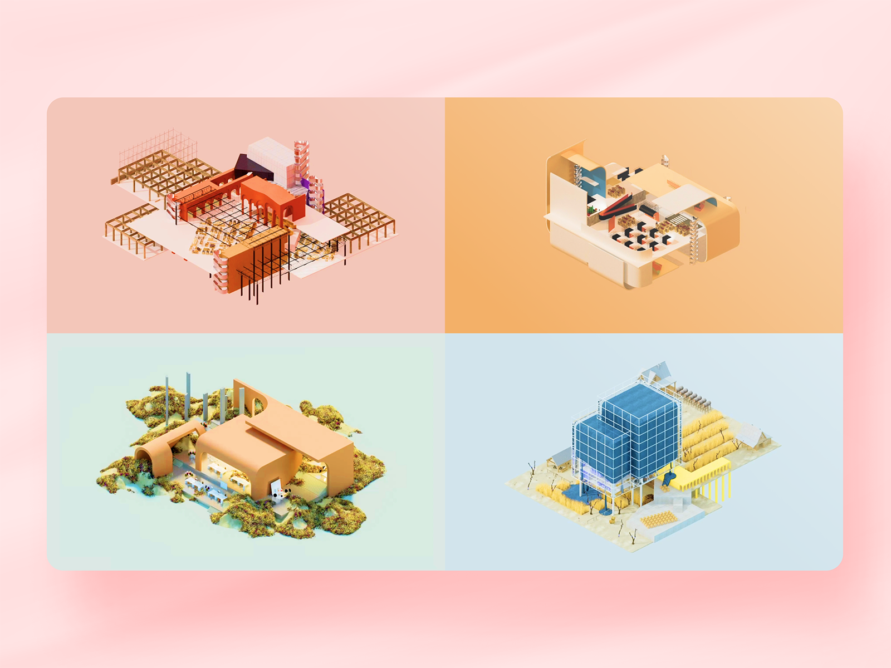

# Four Typologies in Immersive Web3 Architecture Experience

**Recognitions:**
- [2023 Honorable Mention](https://www.awwwards.com/sites/four-typologies) by Awwwards
- [2023 Digital Design Awards Winner](https://gdusa.com/) by Graphic Design USA
  

This web project results from the exploration in the overlapping fields of architecture design, digital media practice, user experience design, and immersive web experience. It allows audiences to discover design features interactively and responsively within a website presentation format for desktop, tablet, and mobile devices. Users can navigate in the virtual environment in terms of both macro and micro observation level. It suggests the possible format of future NFT architectural products following the Web 3.0 and Metaverse tides.

[Website Portal](https://qihangfan.github.io)
  

  

 
Existing factories have a small handicraft upcycling workflow, but their factory typology is insufficient to cover all the designers' activities
The animation aims to express Garden Factory Typologies that resist mechanization trends. They represent emerging fashion houses that produce small batches of upcycled collections on macro and micro scales. And the decentralized factory typologies blended with local environments - the factory, the city, the nature, and the farm - are reinvented.
   

# Production
Multiple skills are involved in the entire production process.
  - 3D software for architecture and digital media production, including Rhino, Cinema 4D, and Redshift.
  - Adobe Suite for the media post-production
  - Figma for the responsive web and user experience design
  - Webstorm for the front-end development
  - Visual Studio Code to achieve the local hosting for the mobile-end development
   

# About Design

## Background
The studio aims at designing a new Garden Factory for emerging fashion houses Duran Lantink and Collina Strada to produce small batch upcycled collections under the umbrella of Prada Group S.p.A. The design topics cover six discourses:
  - Topic 01. Architectural Types — (Fashion) House & Factory
  - Topic 02. Motion Space — Runways IRL, AR, VR
  - Topic 03. Interfaces — Physical/Digital Cameras, Rigs
  - Topic 04. Phygital Material Creation
  - Topic 05. Upcycling — New Forms of Luxury
  - Topic 06. Production Landscapes   

## For Us
After a careful study of Duran Lantink's approach to upcycling, we summarized the process into 7 stages. Duran Lantink starts design thinking from the very first step and he goes through multiple iterations. His workflow is nonlinear and circular.

Although Duran Lantink indicates an upscaling of his small handicraft workflow, we find the current factory typology insufficient for covering all the designers' activities. We further splited the entire factory, reinvent the facotory typology blending with local environments, the factory, the city, the nature, and the farm to be specific (This is how four-typos come into being).
  

## Major Concepts
- **Macro vs Micro**

A factory that resists mechanization trend should maintain original functionality while emphasizing human-centered spaces. On the one hand, the Macro scale indicates our programmatic consideration of the architecture adaption. Each typology iterates and interacts with the local environment. On the other hand, the Micro scale suggests human involvement in all Duran Lantink production processes. Production activities no longer happen in a linear way but jump among various spaces presented in typological miniatures.

- **Decentralization**

Centralized factory seeks the best efficiency. It highlights the simplification of the production process in order to maximize profit. Commercialization resulting from centralization damages human interaction and creativity. Therefore, we emphasize decentralization in the quazi-autonomous factory system to evoke the consciousness of humanity’s sustainability.
   

# Credit
  - Project Designer: Qihang Fan, Kangxin Wu
  - Project Instructor: Peter Testa
  - Web Developer: Qihang Fan
  - Web Development Instructor: Anthony Tran
  
  Copyright © 2020 Qihang Fan. All Rights Reserved
   

# Animation Video Vimeo Portal

## Marfet

  

 

## Exhifition

  

 

## Stufio

  

 

## Tofer

  

