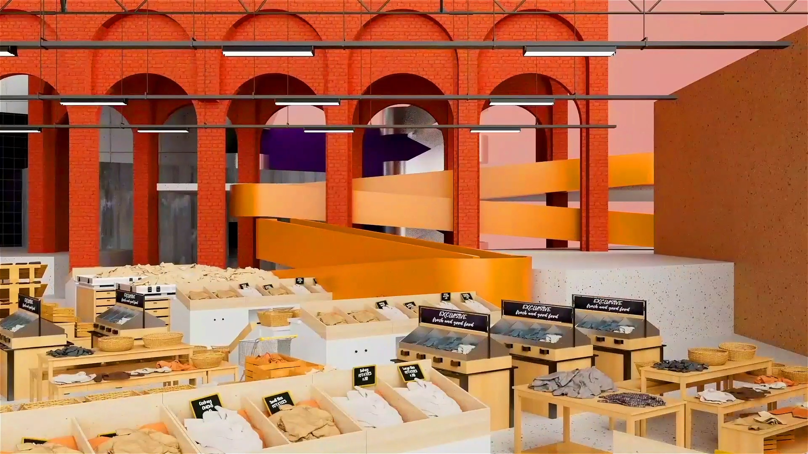
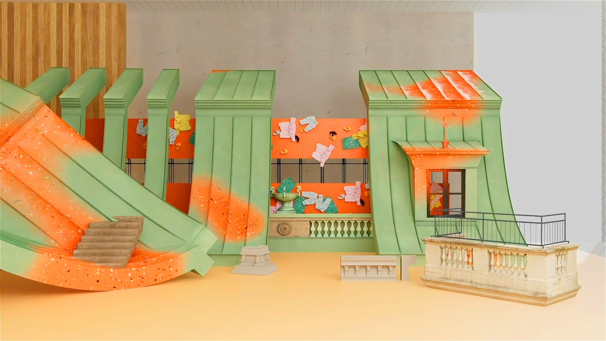
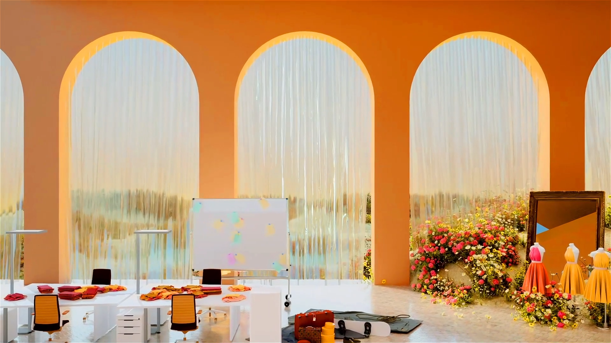
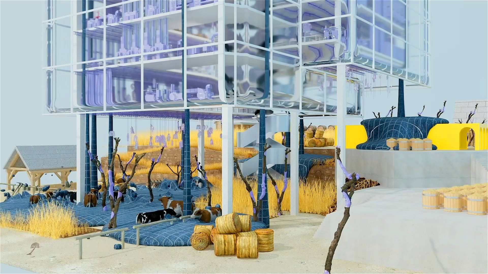

# Four Typologies in Immersive Web3 Architecture Experience

Four Typologies is a responsive interactive media website that introduces new decentralized and localized Garden Fashion Factory Typologies evoking humanity and resisting industrial mechanization trends. The website allows users to explore architectural designs from a macro perspective, appreciating the intricate miniatures, to a micro level where they can engage with nuanced interactions and dynamic textures. It immerses users into a nonlinear upcycling handicraft workflow tailored to each architectural miniature, which makes architectural designs and fashion concepts more tangible, interactive, and accessible to a wider audience.
  

**Recognitions:**
- [2024 iF Design Award Winner](https://ifdesign.com/en/winner-ranking/project/four-typologies-immersive-web-experience/622719) by iF International Forum Design
- [2024 UX Design Awards Nominated](https://ux-design-awards.com/winners/2024-1-four-typologies) by International Design Center Berlin
- [2024 C2A Creative Communication Awards Best of Best Distinction](https://www.c2award.com/winners/c2a/2024/5727/) by Farmani Group
- [2024 AVA Digital Awards in UX Creativity Platinum Winner](https://enter.amcpros.com/ava/entry/four-typologies/) by Association of Marketing and Communication Professionals
- [2024 AVA Digital Awards in Video Creativity Platinum Winner](https://enter.amcpros.com/ava/entry/four-typologies-2/) by Association of Marketing and Communication Professionals
- [2024 K Design Award in Communication Gold Winner](https://kdesignaward.com/index.php?mid=exhibition&search_target=extra_vars2&search_keyword=2024&page=2&document_srl=377830) by DESIGNSORI Co.
- [2024 TITAN Innovation Awards in Interactive Media Platinum Winner](https://titaninnovationawards.com/winner-info.php?id=208) by TITAN Innovation Awards
- [2024 French Design Awards in Product Design Gold Winner](https://frenchdesignawards.com/winner-info.php?id=945) by French Design Awards
- [2024 MUSE Creative Awards in Art&Design Gold Winner](https://museaward.com/winner-info.php?id=228541) by MUSE Creative Awards
- [2024 MUSE Creative Awards in Experimental Website Gold Winner](https://museaward.com/winner-info.php?id=228542) by MUSE Creative Awards
- [2024 Indigo Awards in Interactive Design, Website Design, Digital Art Gold Winner](https://indigoaward.com/winners/7560) by Indigo Design Award
- [2024 DNA Paris Design Awards in Interactive Design Winner](https://dna.paris/winner/zoom.php?eid=71-91358-23) by DNA Paris Design Awards
- [2024 Vega Digital Awards in Website Best Visual Design Gold Winner](https://vegaawards.com/winner-info.php?id=46584) by Vega Digital Awards
- [2024 Vega Digital Awards in Website Innovative Gold Winner](https://vegaawards.com/winner-info.php?id=46582) by Vega Digital Awards
- [2024 NYX Awards in Website Aesthetics Gold Winner](https://nyxawards.com/winner-info.php?id=6628) by NYX Awards
- [2024 NYX Awards in Best User Experience Gold Winner](https://nyxawards.com/winner-info.php?id=6629) by NYX Awards
- [2024 New York Product Design Awards in Interface for Digital Media Silver Winner](https://nydesignawards.com/winner-info.php?id=1766) by New York Product Design Awards
- [2024 Spark Design Awards Finalist](https://galleries.sparkawards.com/index.cfm?year=2024&entry=46E67AFB-D270-6687-3FC323D633E3D1AE) by Spark Design Awards™
- 2024 Interactive Competition Finalist by Communication Arts
- [2023 GOOD DESIGN® Award Winner](https://www.good-designawards.com/award-details.html?award=54570) by The Chicago Athenaeum
- [2023 Digital Design Awards Winner](https://gdusa.com/2023-digital-design-awards-winner?rns=0|36327131) by Graphic Design USA
- [2023 The Motion Awards Winner in Motion Design](https://motionawards.com/four-typologies/) by Motionographer
- [2023 International Design Awards in Website Design Silver Winner](https://www.idesignawards.com/winners/zoom.php?eid=9-49348-23) by International Design Awards
- [2023 International Design Awards in Web Application Design Gold Winner](https://www.idesignawards.com/winners/zoom.php?eid=9-49348-23) by International Design Awards
- [2023 International Design Awards in Multimedia Animation Bronze Winner](https://www.idesignawards.com/winners/zoom.php?eid=9-49348-23) by International Design Awards
- [2023 London Design Awards in UX Experimental / Innovative Gold Winner](https://thelondondesignawards.com/winner-info.php?id=1574) by London Design Awards
- [2023 London Design Awards in UX Art Gold Winner](https://thelondondesignawards.com/winner-info.php?id=1575) by London Design Awards
- [2023 London Design Awards in UX Best Visual Design - Aesthetic Gold Winner](https://thelondondesignawards.com/winner-info.php?id=1573) by London Design Awards
- [2023 Honorable Mention](https://www.awwwards.com/sites/four-typologies) by Awwwards
- [2023 ASUS ProArtist Awards Animation Top 30](https://www.asus.com/campaign/ASUS-ProArtist-Awards-2023/us/winner.php) by ASUSTeK Computer Inc.
  

**Description:**

The design results from the overlapping fields of architecture, digital media, user experience, and immersive web design. Traditional 2D diagrams and renderings often fall short of capturing the richness of architectural concepts and spatial experiences. To remedy this, web-based interactive digital media has been introduced. Easily accessible via a web browser, it offers users an accessible seamless 3D immersive experience without the need for specialized VR technology. It addresses challenges in understanding advanced architectural concepts and visualizing complex fashion design workflows inclusively and responsively across various digital platforms.
  

**Quick Link:**
- [Four Typologies Website Portal](https://qihangfan.github.io)
- [Four Typologies Web App Trailer Video](https://youtu.be/lbqqF0dWa7A?si=CVNw7wiJV_UTixrd)
  

  

 
Contemporary fashion houses introduce a small upcycling handicraft workflow, but their factory typology is insufficient to support the nonlinear designers' activities. The media design aims to express the new Garden Factory Typologies that evoke humanity and resist conventional industrial mechanization trends. They represent emerging fashion houses that produce small batches of upcycled collections from the micro to the macro scale. And the decentralized factory typology miniatures blended with local environments - the market, the city, the nature, and the farm - are reinvented.
   

# Production
Multiple skills are involved in the entire production process.
  - 3D software for architecture and digital media production, including Rhino, Cinema 4D, and Redshift.
  - Adobe Suite for the media post-production
  - Figma for the responsive web and user experience design
  - Webstorm for the front-end development
  - Visual Studio Code to achieve the local hosting for the mobile-end development
   

# About Design

## Background
The studio aims at designing a new Garden Factory for emerging fashion houses like Duran Lantink and Collina Strada to produce small-batch upcycled collections under the umbrella of Prada Group S.p.A. The design topics cover six discourses:
  - Topic 01. Architectural Types — (Fashion) House & Factory
  - Topic 02. Motion Space — Runways IRL, AR, VR
  - Topic 03. Interfaces — Physical/Digital Cameras, Rigs
  - Topic 04. Phygital Material Creation
  - Topic 05. Upcycling — New Forms of Luxury
  - Topic 06. Production Landscapes   

## Research
The fundamental research explored the upcycling concept that avant-garde fashion houses advocate and practice contemporarily. The upcycling design process includes 7 phases – deadstock dive, deconstruction, categorization, ideation, combination, reconstruction, and audition. However, fashion designers would go through multiple rounds of iteration and leap back and forth to compose the most satisfying pieces. The upcycling production workflow challenges the traditional linear and circular mechanical assembly line and raises the awareness of humanity. In that case, the direct dimension scaling would not work. New factory typologies and spaces need to be redefined.
  

## Major Concepts
- **Macro vs Micro**

A factory that resists mechanization trends should maintain original functionality while emphasizing human-centered spaces. On the one hand, the Macro Scale indicates our programmatic consideration of the architecture adaption. Each typology iterates and interacts with the local environment. On the other hand, the Micro Scale suggests human involvement in all production processes, like Duran Lantink. Production activities no longer happen in a linear way but jump among various spaces presented in typological miniatures.

- **Decentralization**

A centralized factory seeks the best efficiency. It highlights the simplification of the production process in order to maximize profit. Commercialization resulting from centralization damages human interaction and creativity. Therefore, we emphasize decentralization in the quasi-autonomous factory system to evoke the consciousness of humanity’s sustainability.
   

# Credit
  - Project Designer: Qihang Fan, Kangxin Wu
  - Project Instructor: Peter Testa
  - Web Developer: Qihang Fan
  - Web Development Instructor: Anthony Tran
  
  Copyright © 2020 Qihang Fan. All Rights Reserved
   

# Animation Video Vimeo Portal

## Marfet

  

 

## Exhifition

  

 

## Stufio

  

 

## Tofer

  

